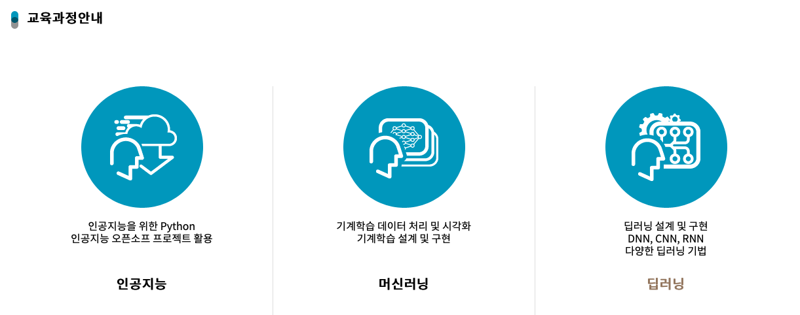
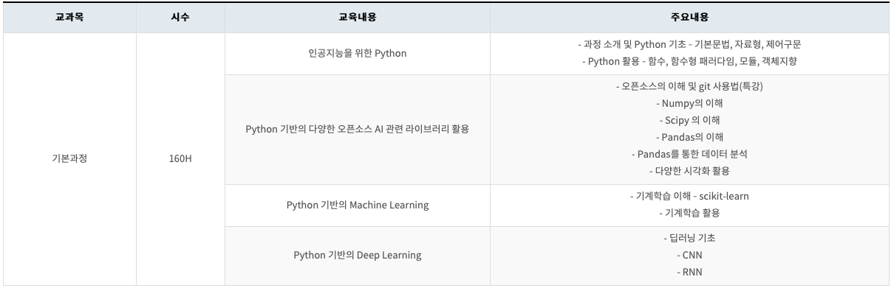

# [AI 이노베이션 스퀘어] 기본 저녁반 11 기

---

  <h2 style='font-weight: bold; font-size:18px;'>주관</h2>
  
  &nbsp;&nbsp;&nbsp;
  

 

## 필기자료(링크)
 
### [1일차 필기자료 : Jupyter Notebook & Markdown, Python1](https://github.com/hysKim1/AI_Fundamental/blob/master/200701_11%EA%B8%B0_%EA%B8%B0%EB%B3%B8%EC%A0%80%EB%85%81%EB%B0%98_%ED%95%84%EA%B8%B01.ipynb)
    - Jupyter Notebook & Markdown
    - Python
    
### [2일차 필기자료 : Python 자료형 ](https://github.com/hysKim1/AI_Fundamental/blob/master/200702_11기_기본저녁반_필기.ipynb)
    - 자료형: atomic, container
      - string, List, Tuple, Range, Set, Frozenset
    
    
### [3일차 필기자료 : Python 함수1](https://github.com/hysKim1/AI_Fundamental/blob/master/200703_11기_기본저녁반_필기.ipynb)
    - PEP: Naming, Trailing comma
    - 할당6가지 : 기본, 복합,unpacking, starred, 증감, global & nonlocal
    - 조건문 : if, else, elif, pass, none, 
    - 삼항 연산자, 논리 연사자(AND,OR), IN, NOT IN
    - 반복문 : for, break, continue
    
### [4일차 필기자료 : Python 함수2](https://github.com/hysKim1/AI_Fundamental/blob/master/200706_11기_기본저녁반_필기.ipynb)
    - 예외처리문  :Try, except, as, else,finally, assert, raise from, 
    - Function : 함수 선언/정의, 디폴트값, Signature, docstring, 매개변수 할당하는 7자기 

### [5일차 필기자료 : Python 함수3](https://github.com/hysKim1/AI_Fundamental/blob/master/200707_11기_기본저녁반_필기.ipynb)
    - 함수
      - 함수 반환값 ,중첩,closure, higher order func, scope, overloading, 재귀, lambda, *, namespace, callable

    
### [11일차 필기자료 :Numpy 1](https://github.com/hysKim1/AI_Fundamental/blob/master/200715_11기_기본저녁반필기.ipynb)
    - Numpy
    - array, ndarray, zeros, ones,full,empty, identity, linespace,logspace
      - shape, ndim,size, dtype,reshape, concatnate
### [12일차 필기자료 :Numpy 2](https://github.com/hysKim1/AI_Fundamental/blob/master/200716_11기_기본저녁반_필기.ipynb)
    - arange ,repeat,reshape ,resize 
    - Image
    - Indexing :Array Indexing / slicing , Boolean Indexing, Fancy Indexing
    - 차원 증가 방법: shape, reshape, None, newaxis, expand_dims
    - 배열 연산 : broadcasting

### [13일차 필기자료 :Numpy 3](https://github.com/hysKim1/AI_Fundamental/blob/master/200717_11기_기본저녁반_필기.ipynb)
    - Array 정보 : shape,ndim size ,dtype ,itemsize , data
    - Array 생성 :_like( zeros,onex,empty,full_like) fromfunction
    - Copy :pyton shallow /deep copy, Numpy shallow/ deep copy, new copy: reshape,resize
    - Array 한줄로 변환 flatten, ravel
    - Array 분할: split, hsplit,vsplit, unpacking응용
    - Universal Function(ufunc)): np.abs, np.sum
    - 행렬 연산: np.multiply *,np.dot @
    - Array Iterating : flat, ndenmerate, strides
    - Numpy Help : info, lookfor
    - Scipy
    
### [14일차 필기자료 :Numpy 4& 	Pandas를 통한 데이터 분석 (1)](https://github.com/hysKim1/AI_Fundamental/blob/master/200720_11기_기본저녁반_필기.ipynb)
    - repr, str
    - Array 분할: np.split, np.hsplit,np.vsplit  , Array 결합:concatnate,append,hstack,column_stack, vstack,row_stack, stack, r_,c_
    - 원소 배열 변환 ; np.swapaxes, T transpose
    - Structured Arrays 생성,indexing
    - Pandas 통한 분석:읽기:read_csv, 정보: info, 열, 행,  인덱싱,filtering: boolean indexing, Aggregation: groupby, 시각화: line,bar, pie
    
### [15일차 필기자료 : 	Pandas를 통한 데이터 분석 (2) ](https://github.com/hysKim1/AI_Fundamental/blob/master/200721_11%E1%84%80%E1%85%B5_%E1%84%80%E1%85%B5%E1%84%87%E1%85%A9%E1%86%AB%E1%84%8C%E1%85%A5%E1%84%82%E1%85%A7%E1%86%A8%E1%84%87%E1%85%A1%E1%86%AB_%E1%84%91%E1%85%B5%E1%86%AF%E1%84%80%E1%85%B5.ipynb)
    - Pandas: 1.데이터불러오기 2. 데이터 정보: info, head, tail,sample 3.EDA: Unique,nunique,describe,values_countes, 시각화:pie,bar,boxplot
    - descibe의 다형성, 산점도 행렬, Aggregation:groupby  데이터 정렬: sort, sorted, sort_values, sort_index; index 변경: set_index, reset_index
### [16일차 필기자료 : 	Pandas를 통한 데이터 분석 (3)](https://github.com/hysKim1/AI_Fundamental/blob/master/200722_11%EA%B8%B0_%EA%B8%B0%EB%B3%B8%EC%A0%80%EB%85%81%EB%B0%98_%ED%95%84%EA%B8%B0.ipynb)
    - 데이터 불러오기: read, 데이저 정보: info, 데이터 결합:concat, append, columns :추가,  drop, rename , Aggregation: groupby, pivot table, crosstab, 
    - Tidy Data 연습, 기계학습 예시(KNN)
### [17,18일차 필기자료 : Pandas를 통한 전처리 (1) ](https://github.com/hysKim1/AI_Fundamental/blob/master/200723_11%EA%B8%B0_%EA%B8%B0%EB%B3%B8%EC%A0%80%EB%85%81%EB%B0%98_%ED%95%84%EA%B8%B0.ipynb)
     - 추천 시스템
     - README, 데이터 불러오기, 결합: rename, concat, append, merge,  전처리 :drop, indexing, select_dtypes,to_numeric, max_rows
     - Reshaping: melt, stack, unstack, pivot ,결측치: fillna, 상관분석: 조건문,apply
### [19일차 필기자료 : Pandas를 통한 전처리 (2)](https://github.com/hysKim1/AI_Fundamental/blob/master/200727_11%EA%B8%B0_%EA%B8%B0%EB%B3%B8%EC%A0%80%EB%85%81%EB%B0%98_%ED%95%84%EA%B8%B0.ipynb)
    - 기계학습(KNN) 맛보기, DESCR,data,feature_names, target
    - 결측치 : isnull, isna, fillna, 
    - 데이터 타입 변환: map, category, astype(object)
    
### [20일차 필기자료 : Pandas를 통한 전처리 (3)]( https://github.com/hysKim1/AI_Fundamental/blob/master/200728_11%EA%B8%B0_%EA%B8%B0%EB%B3%B8%EC%A0%80%EB%85%81%EB%B0%98_%ED%95%84%EA%B8%B0.ipynb)
     - 시간날짜 :calendar, datetime,strptime, strftime;  to_datetime, resample, OHLC
     - 지도 folium : Map, Marker, CircleMarker,Circle + iterrows,itertuples
     - 그래프 matplotlib.pyplot: State Machine, figure,axes,subplots, title,label, legend, grid,ticks, lim, style.use, style.context 
### [21일차 필기자료 : 기계학습: Scikit-Learn (1)](https://github.com/hysKim1/AI_Fundamental/blob/master/200729_11%EA%B8%B0_%EA%B8%B0%EB%B3%B8%EC%A0%80%EB%85%81%EB%B0%98_%ED%95%84%EA%B8%B0.ipynb)
    -   sklearn : 학습: knn.fit, 예측: knn.perdict, 데이터 분할: train_test_split , 검정(정확도): knn.score
    
### [22일차 필기자료 : 기계학습: Scikit-Learn (2)](https://github.com/hysKim1/AI_Fundamental/blob/master/200730_11%EA%B8%B0_%EA%B8%B0%EB%B3%B8%EC%A0%80%EB%85%81%EB%B0%98_%ED%95%84%EA%B8%B0.ipynb )
    -  과정: 데이터 준비, EDA,데이터 분할, 모델 학습, 모델 성능 평가, 모델 비교,  전처리에 따른 성능변화 : scaling ( MinMaxScaler,StandardScaler,RobustScaler , MaxAbsScaler)최적의 성능 : Overfiting, Underfiting, cross-validation(cross_val_score)
### [23일차 필기자료 : 기계학습: Scikit-Learn (3)]( https://github.com/hysKim1/AI_Fundamental/blob/master/200731_11%EA%B8%B0_%EA%B8%B0%EB%B3%B8%EC%A0%80%EB%85%81%EB%B0%98_%ED%95%84%EA%B8%B0.ipynb)
    - 과정 : 결측치 처리 :fillna, SimpleImputer, KNNImputer, Encoding : Label Encoding (map, LabelEncoder), One-Hot Encoding(get_dummies, OneHotEncoder)
    - EDA:  상관관계 :pairplot, corr, heatmap, 모델분류 : Linear Regression, KNeighborsRegressor, DecisionTreeRegressor, 평가척도 : confusion_matrix
### [24일차 필기자료 : 기계학습: Scikit-Learn (4)]( https://github.com/hysKim1/AI_Fundamental/blob/master/200803_11%EA%B8%B0_%EA%B8%B0%EB%B3%B8%EC%A0%80%EB%85%81%EB%B0%98_%ED%95%84%EA%B8%B0.ipynb)
    -  ML 복습, 성능조적 1.Model Selection ,2.Preprocessing : scaler
    -  Classification Metric : confusion_matrix, 
    -  classification_report: Accuracy,Precision, Recall, F-1
    - Titanic : Encodng, 범주화 : cut, qcut,  Aggregation
### [25일차 필기자료 : 기계학습: Scikit-Learn (5)](https://github.com/hysKim1/AI_Fundamental/blob/master/200804_11%EA%B8%B0_%EA%B8%B0%EB%B3%B8%EC%A0%80%EB%85%81%EB%B0%98_%ED%95%84%EA%B8%B0.ipynb )
    - ML 복습, 이미지 : 이미지 특성, 채널, 이미지 데이터, 전처리,데이터 학습 
    - 파이프라인: Pipeline, make_pipeline, ColumnTransformer, overloading
### [26일차 필기자료 : 기계학습: Scikit-Learn (6)](https://github.com/hysKim1/AI_Fundamental/blob/master/200805_11%EA%B8%B0_%EA%B8%B0%EB%B3%B8%EC%A0%80%EB%85%81%EB%B0%98_%ED%95%84%EA%B8%B0.ipynb )
    -  검정: Holdout( 2-way,3-way), cross_val_score, learning_curve
    -  자동화 : Pipeline,GridSearchCV
    - feature seleciton: filter, wrapper ,embeded
### [27일차 필기자료 : 기계학습: Scikit-Learn (7)]( )
### [28일차 필기자료 : 기계학습: Scikit-Learn (8)](https://github.com/hysKim1/AI_Fundamental/blob/master/200807_11기_기본저녁반_필기.ipynb )
    - 비지도학습 : clustering : KMeans, AgglomerativeClustering /w dendrogram,DBSCAN 
    - Deep Learning: Perceptron : OR, AND , XOR, MLP/ANN , 책추천
### [29일차 필기자료 : 기계학습: Scikit-Learn (9)]( )
### [30일차 필기자료 : 기계학습: Scikit-Learn (10)]( )

--- 

- [AI 이노베이션 스퀘어](https://ai.koipa.or.kr/)
